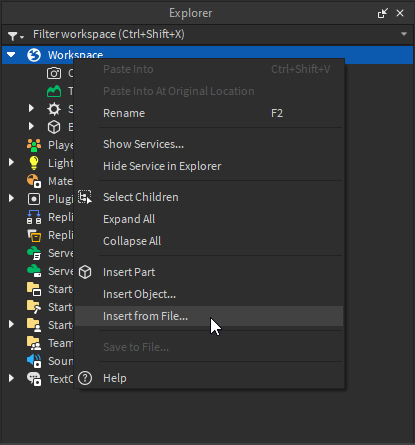
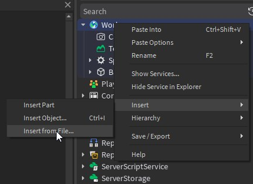
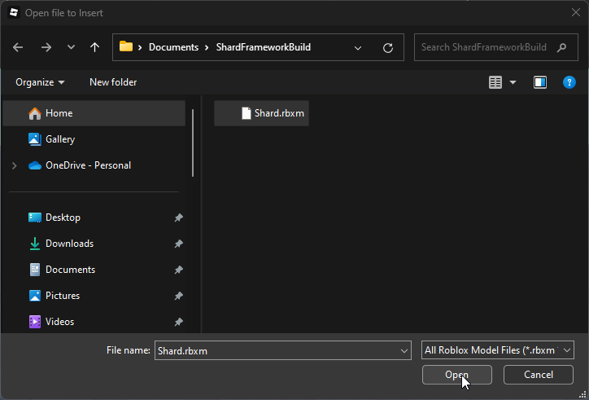

import ReactPlayer from 'react-player'

# Installation

Install shard using a model file

## 1. Download shard
The first step is downloading the Shard model file. You can find the latest version of Shard in the [GitHub repository releases](https://github.com/LuminaLabs-Games/Shard/releases)

## 2. Insert to Roblox Studio

- Select and right click `Workspace` in the explorer and right select `Insert from File`

With the new roblox studio UI:

- The file system/explorer will open and you can select the `Shard` model file you downloaded in the first step. Select it and click `Open`.

## 3. Move and Ungroup
After inserting the model in workspace, open the model and you will find several sub-models named where they should be moved to and ungrouped.

  <ReactPlayer playing controls loop={true} url='/vids/move_ungroup.mp4' />

