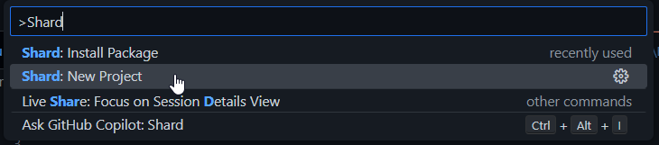
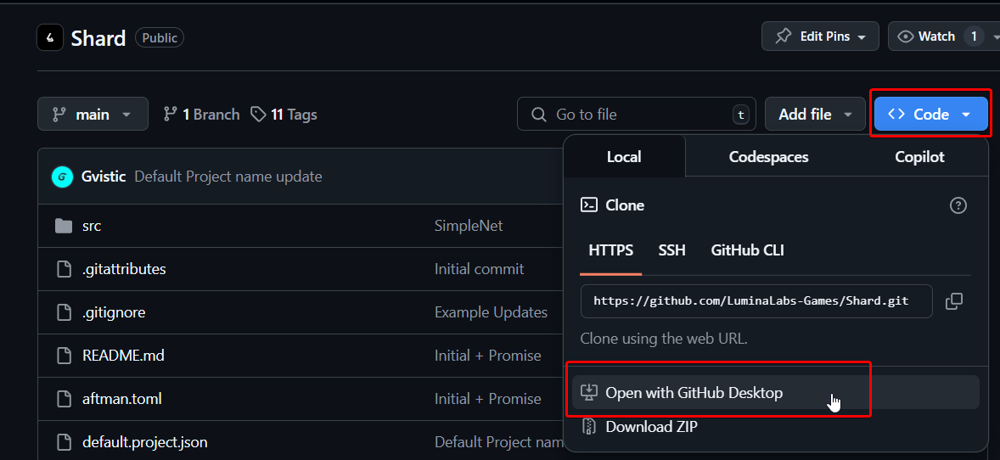
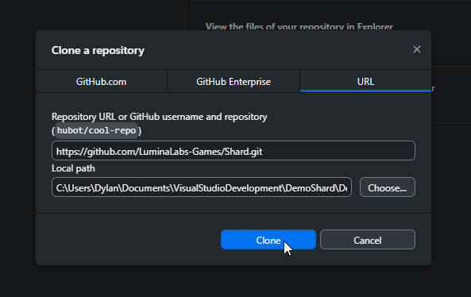

# Installation

Install shard using Visual Studio Code or GitHub Desktop.

With [Visual Studio Code](https://code.visualstudio.com/), you have two ways of installing Shard. With our visual studio code extension, or by cloning the repository with [Git](https://git-scm.com/) and/or [GitHub Desktop](https://desktop.github.com/).

We recommend using the **[Visual Studio Code extension](https://marketplace.visualstudio.com/items?itemName=WilWilson.shard-framework)** for a smoother experience, especially if you're new to Shard.

---

## Installing Shard with Visual Studio Code Extension
### 1. Install the Extension
The easiest way to install Shard is by using the Shard Visual Studio Code extension.
This extension provides a simple interface for managing Shard. It also provides a way to easily install Shard packages.

1. Open [Visual Studio Code](https://code.visualstudio.com/).
2. Go to the Extensions view by clicking on the Extensions icon in the Activity Bar on the side of the window. You can also open it by pressing `Ctrl + Shift + X` (Windows/Linux) or `Cmd + Shift + X` (Mac).
3. Search for "Shard" in the Extensions Marketplace.
4. Download `shard-framework` by `Wil Wilson`

Optionally you can download the extension from the Visual Studio marketplace **[Shard Extension](https://marketplace.visualstudio.com/items?itemName=WilWilson.shard-framework)**.


### 2. Initialize Shard with the Extension
Once you have the extension installed, you can initialize Shard in your project.

1. Open or create a folder in Visual Studio Code where you want to create your Shard project.
2. Open the Command Palette by pressing `Ctrl + Shift + P` (Windows/Linux) or `Cmd + Shift + P` (Mac).
3. Type `Shard: New Project` and select it.




### 3. Use Rojo to Visual Studio Code to Roblox Studio
If you're new to Visual Studio Code with LuaU, we recommend using [Rojo](https://rojo.space/) to connect your code to Roblox Studio. Rojo is a tool that allows you to sync your local files with Roblox Studio.

We recommend pairing Rojo with extensions such as **[StyLua](https://marketplace.visualstudio.com/items?itemName=JohnnyMorganz.stylua)** for formatting your code, and **[Luau Language Server](https://marketplace.visualstudio.com/items?itemName=JohnnyMorganz.luau-lsp)** for code completion and linting.

---

## Installing Shard by Cloning the Repository

You can also install Shard by cloning the repository from GitHub. This method is ideal if you want full control over the source or plan to contribute to development.


### Option 1: Using GitHub Desktop

#### Method A: Open Directly from GitHub

1. Make sure **[GitHub Desktop](https://desktop.github.com/)** is installed.
2. Go to the **[Shard GitHub page](https://github.com/LuminaLabs-Games/Shard)**.
3. Click the **Code** button and choose **Open with GitHub Desktop**.
4. In GitHub Desktop, set the local path where you want to clone the repository and click **Clone**.





5. To open the project in Visual Studio Code:

   * Go to the top menu and click `Repository` > `Open in Visual Studio Code`,
   * Or use the shortcut `Ctrl + Shift + A` (Windows/Linux) or `Cmd + Shift + A` (Mac).

---

#### Method B: Manually Clone via GitHub Desktop

1. Launch **[GitHub Desktop](https://desktop.github.com/)**.
2. Go to `File` > `Clone Repository`.
3. Make sure the current tab is the **URL** tab, where you can input the repository URL.
4. Copy & Paste the repository URL in the URL field:
   ```
   https://github.com/LuminaLabs-Games/Shard.git
   ```
5. Select a local path where you want to clone the repository and click **Clone**.
6. Open it in VS Code via the `Repository` menu or shortcut as above.


---

### Option 2: Using Bash

1. Open a terminal.
2. Navigate to the directory where you'd like to clone the project.
3. Run:
   ```bash
   git clone https://github.com/LuminaLabs-Games/Shard.git
   cd Shard
   code .
   ```


--- 

Awesome now that you have Shard installed, lets overlook the overall structure of Shard and some of its key components.

Next: [Learn more about Shard's structure and components. →](../structure-overview)
